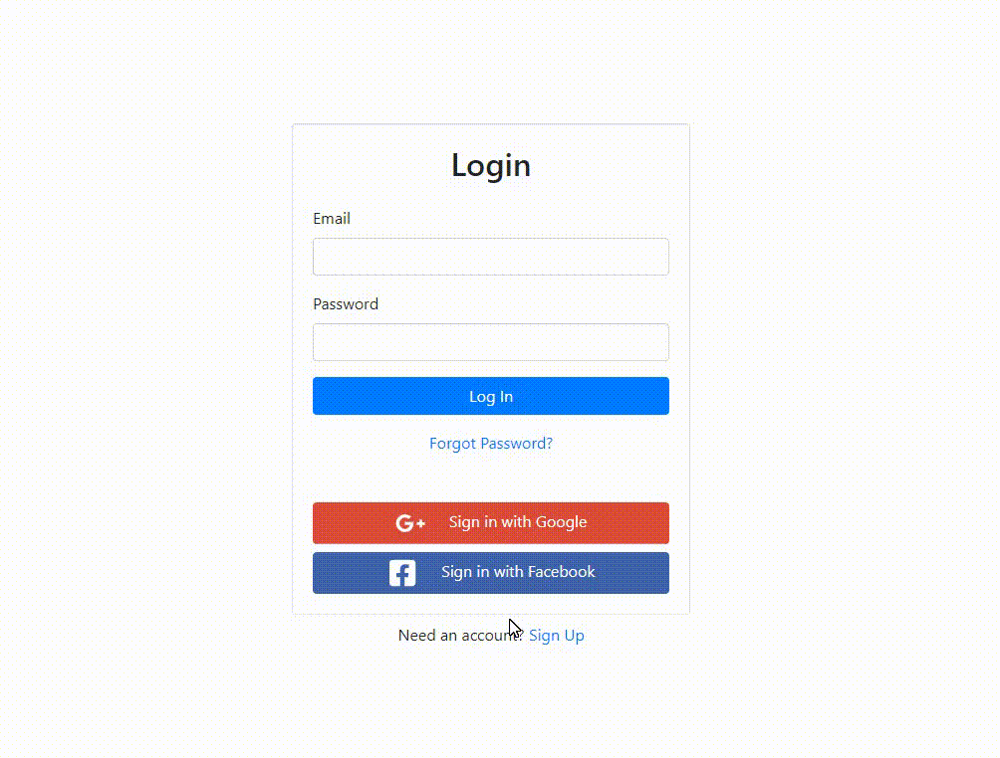
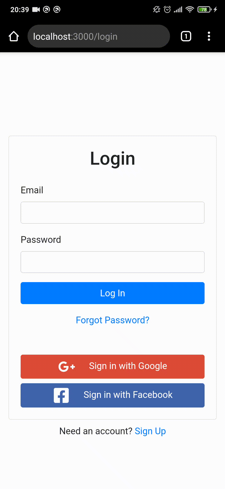

# Firebase Authentication


<br />
<br />
<div align="center">
  
</div>

---

## About

This is a sample React application (bootstrapped with [create-react-app](https://reactjs.org/docs/create-a-new-react-app.html)) with Firebase authentication. There are three authentication methods implemented: `email and password`, `google` and `facebook`.

---

## Features

- Login with Email and Password
- Login with Facebook
- Login with Google
- Update profile
- Logout

---

## Running

1. ```shell
   git clone https://github.com/CaioQuirinoMedeiros/Firebase-Authentication.git
   ```

2. ```shell
   cd Firebase-Authentication
   ```

3. ```shell
   yarn install
   ```

4. ```shell
   yarn start
   ```

<br />

### Styled with [React Bootstrap](https://react-bootstrap.github.io/)

<br />

---

<div style="display:flex;gap:32px;align-items:center">
  
  <span style="font-size:34px;font-weight:600;flex-grow:1">Caio Quirino Medeiros</span>
   <a href="https://github.com/CaioQuirinoMedeiros" target="_blank">
      
   </a>
   <a href="https://www.linkedin.com/in/caio-quirino-medeiros/" target="_blank">
      
   </a>
   <a href="mailto:caio.quirino.medeiros@gmail.com" target="_blank">
      
   </a>
   <a href="https://app.rocketseat.com.br/me/caio-medeiros-1562947679" target="_blank">
      
   </a>
</div>

---
